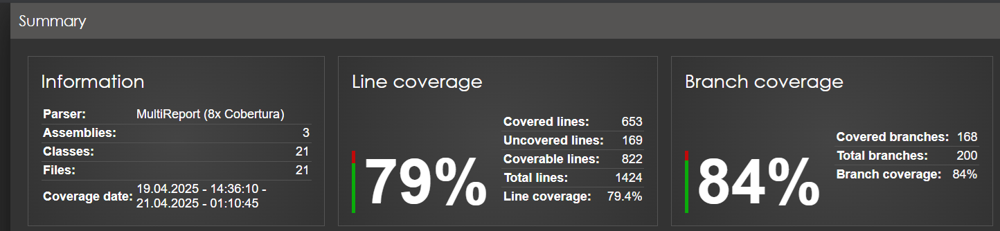

# Currency Converter API

A robust, scalable, and maintainable currency conversion API built using C# and ASP.NET Core. This API provides currency conversion functionality, exchange rate retrieval, and historical exchange rate data.

## Features

- **Latest Exchange Rates**: Retrieve current exchange rates for any base currency
- **Currency Conversion**: Convert amounts between different currencies
- **Historical Exchange Rates**: Access historical exchange rate data with pagination
- **Security**: JWT authentication and role-based access control
- **Performance**: Caching, resilience patterns (retry, circuit breaker)
- **API Throttling**: Rate limiting to prevent abuse
- **Comprehensive Logging**: Client IP, request details, response time tracking
- **OpenTelemetry**: Distributed tracing for monitoring and debugging

## Code Coverage



Our codebase maintains a solid overall coverage rate of **79.4%** for line coverage and **84%** for branch coverage. Here's a breakdown of our coverage metrics:

1. **Component Coverage**:
   - **CurrencyConverter.Core**: 100% line and branch coverage
   - **CurrencyConverter.Infrastructure**: 95.1% line coverage, 91.6% branch coverage
   - **CurrencyConverter.API**: 59.2% line coverage, 72.6% branch coverage

2. **High-Value Components**:
   - **Controllers**: 100% line coverage across all endpoints
   - **API Middleware components**: 94-100% line coverage
   - **CurrencyValidationService**: 100% line and branch coverage
   - **JwtTokenService**: 100% line coverage, 91.6% branch coverage
   - **MemoryCacheService**: 100% line and branch coverage

3. **Lower Coverage Areas**:
   - **Program.cs**: 0% coverage (startup and configuration code)
   - Some infrastructure components have minor gaps in branch coverage

4. **Test Quality Focus**: We prioritize meaningful tests that verify behavior rather than achieving arbitrary coverage numbers.

For our test suite, we use:
- **xUnit**: For unit and integration testing
- **Coverlet**: For collecting code coverage data
- **ReportGenerator**: For generating detailed HTML coverage reports

Tests can be run with code coverage using:
```bash
# Generate coverage data
dotnet test /p:CollectCoverage=true /p:CoverletOutputFormat=cobertura

# Convert to HTML report
reportgenerator -reports:"**/*.cobertura.xml" -targetdir:"CoverageReport" -reporttypes:Html
```

## Tech Stack

- ASP.NET Core 9.0
- Serilog for structured logging
- OpenTelemetry for distributed tracing
- JWT for authentication
- Memory Cache for caching
- Polly for resilience patterns

## Docker Deployment

You can run the application in a Docker container.

### Build the Docker image

```bash
docker build -t currency-converter -f CurrencyConverter.API/Dockerfile .
```

### Run the Docker container using Development Configuration

To use development settings (reads from appsettings.Development.json):

```bash
docker run -d -p 8080:8080 -e ASPNETCORE_ENVIRONMENT=Development --name currency-converter-app currency-converter
```

### Access the application

- Swagger UI: `http://localhost:8080/swagger/index.html`

### Docker management commands

- View running containers: `docker ps`
- Stop the container: `docker stop currency-converter-app`
- Remove the container: `docker rm currency-converter-app`
- View container logs: `docker logs currency-converter-app`
- View environment variables: `docker exec currency-converter-app printenv`

## Setup Instructions w/o docker

### Prerequisites

- .NET 9.0 SDK or later
- Visual Studio 2022 or VS Code with C# extension

### Getting Started

1. **Clone the repository**
   ```
   git clone [repository-url]
   cd CurrencyConverter
   ```

2. **Restore dependencies**
   ```
   dotnet restore
   ```

3. **Update appsettings.json**
   - Configure JWT settings in `appsettings.json`:
   ```json
   "JwtSettings": {
     "Secret": "<your-secret-key>",
     "Issuer": "CurrencyConverterApi",
     "Audience": "CurrencyConverterClient",
     "DurationInMinutes": 60
   }
   ```

4. **Build the solution**
   ```
   dotnet build
   ```

5. **Run the application**
   ```
   cd CurrencyConverter.API
   dotnet run
   ```

6. **Access the Swagger UI**
   - Navigate to `https://localhost:7004/swagger` in your browser
   - For HTTP: `http://localhost:5157/swagger`

### Testing

Run the automated tests:
```
dotnet test
```

## API Documentation

### Authentication

POST `/api/v1/auth/login`
- Request body: `{ "username": "user", "password": "password" }` or `{ "username": "admin", "password": "admin" }` for admin role
- Response: JWT token for API access

### Exchange Rates

GET `/api/v1/rates/latest?baseCurrency=EUR`
- Get latest exchange rates for a base currency
- Requires authentication

GET `/api/v1/rates/historical?from=2023-01-01&to=2023-01-31&baseCurrency=EUR&page=1&pageSize=10`
- Get historical exchange rates with pagination
- Requires authentication with Admin or Premium role

### Currency Conversion

GET `/api/v1/convert?from=EUR&to=USD&amount=100`
- Convert amount from one currency to another
- Requires authentication

## Assumptions Made

1. **Rate Limiting**: Base rate limit is set to 100 requests per minute per client, which is configurable.
2. **Caching Strategy**: 
   - Latest exchange rates are cached for 30 minutes
   - Historical exchange rates are cached for 24 hours
3. **Restricted Currencies**: TRY, PLN, THB, and MXN are restricted as per requirements
4. **Resilience Strategy**:
   - Retry with exponential backoff for transient errors
   - Circuit breaker to prevent cascading failures
5. **Security**: All endpoints require authentication, with historical rates requiring specific roles

## Possible Future Enhancements

1. **Additional Exchange Rate Providers**:
   - Add providers like Open Exchange Rates, ExchangeRate-API, or European Central Bank
   - Implement provider failover for increased resilience

2. **Enhanced Caching**:
   - Implement distributed Redis cache for horizontal scaling
   - Add cache invalidation strategies for exchange rate updates

3. **Performance Improvements**:
   - Implement batch currency conversion
   - Add GraphQL support for flexible querying

4. **Advanced Security**:
   - Implement API key management
   - Add OAuth 2.0 support
   - Implement more granular permissions

5. **Monitoring and Analytics**:
   - Add Prometheus metrics
   - Create Grafana dashboards
   - Implement usage analytics

6. **Additional Features**:
   - Currency trend analysis
   - Alerts for significant rate changes
   - Scheduled conversions and reports